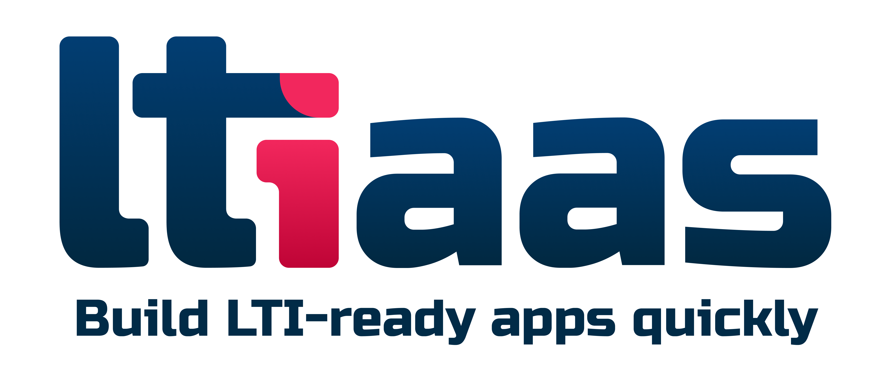

# LTIaaS Launch™ Node.js SDK

[](https://ltiaas.com)

The LTIAAS Launch™ Node.js SDK is a comprehensive client library that provides easy integration with the LTIAAS platform for managing LTI (Learning Tools Interoperability) connections between learning platforms and tools.

The SDK handles all the complex LTI protocol requirements while providing a clean, intuitive interface for developers to build LTI tool integrations. It supports both LTI 1.3 and legacy versions, making it versatile for different integration needs.

More information about the LTIAAS platform can be found at [https://ltiaas.com](https://ltiaas.com).

## Installation
```bash
npm install ltiaas
```

Table of Contents

1. [Installation](#installation)
2. [Authentication](#authentication)
    - LTIK Token Authentication
    - Service Key Authentication
    - API Key Authentication
    - Authentication Examples
3. [Error Handling](#error-handling)
4. [Core Methods](#core-methods)
    - ID Token
        - [getIdToken](#getidtoken)
        - [getRawIdToken](#getrawidtoken)
    - Deep Linking
        - [buildDeepLinkingForm](#builddeeplinkingform)
        - [buildDeepLinkingFormComponents](#builddeeplinkingformcomponents)
    - Memberships
        - [getMemberships](#getmemberships)
    - Line Items & Scores
        - [getLineItems](#getlineitems)
        - [createLineItem](#createlineitem)
        - [getLineItem](#getlineitem)
        - [updateLineItem](#updatelineitem)
        - [deleteLineItem](#deletelineitem)
        - [submitScore](#submitscore)
        - [getScores](#getscores)
    - Intermediate Target Dynamic Registration
        - [getRegistrationRequest](#getregistrationrequest)
        - [getRawRegistrationRequest](#getrawregistrationrequest)
        - [completeRegistrationRequest](#completeregistrationrequest)
    - Platform (LMS) Registration Management
        - [getPlatforms](#getplatforms)
        - [getPlatform](#getplatform)
        - [registerPlatform](#registerplatform)
        - [updatePlatform](#updateplatform)
        - [deletePlatform](#deleteplatform)
        - [activatePlatform](#activateplatform)
        - [deactivatePlatform](#deactivateplatform)

## Authentication
The SDK supports three authentication methods:

- LTIK Token Authentication
- Service Key Authentication
- API Key Authentication

### Authentication Examples

```js
// LTIK Authentication
const client = new LaunchClient({
  apiKey: "your-api-key",
  ltik: "your-ltik-token"
});
```

```js
// Service Key Authentication
const client = new LaunchClient({
  apiKey: "your-api-key",
  serviceKey: "your-service-key"
});
```

```js
// API Key Authentication
const client = new LaunchClient({
  apiKey: "your-api-key"
});
```

## Error Handling

The SDK includes built-in validation and error handling. For example, when using incorrect session types:

```js
// This will throw InvalidSessionError if using wrong authentication type
try {
  await client.getIdToken(); // Requires LTIK authentication
} catch (error) {
  if (error instanceof InvalidSessionError) {
    console.error(`Current session: ${error.currentSession}`);
    console.error(`Allowed sessions: ${error.allowedSessionTypes.join(', ')}`);
  }
}
```

## Core Methods

All of the LTIAAS API methods are available through the SDK. For more information about the LTIAAS API, refer to the [LTIAAS Launch™ API Documentation](https://ltiaas.com/api/ltiaas.

### getIdToken

Retrieves the decoded LTI ID token for the current launch context. This method requires LTIK authentication.

#### Parameters

This method takes no parameters.

#### Return Type

Returns a Promise that resolves to an `IdToken` object containing:

|Property|Type|Description|
|---|---|---|
|ltiVersion|string|The LTI version being used|
|user|object|User information including:|
|user.id|string|Unique identifier for the user|
|user.roles|string[]|Array of LTI roles for the user|
|user.name|string?|User's full name|
|user.email|string?|User's email address|
|user.givenName|string?|User's first name|
|user.familyName|string?|User's last name|
|user.roleScopeMentor|string[]?|Array of mentor role scopes|
|platform|object|Platform information including:|
|platform.id|string?|Platform identifier|
|platform.url|string?|Platform URL|
|platform.clientId|string?|Client ID for the platform|
|platform.name|string?|Platform name|
|platform.version|string?|Platform version|
|launch|object|Launch context information including:|
|launch.type|enum|Type of LTI launch|
|launch.target|string?|Launch target|
|launch.context|object?|Course context information|
|launch.resourceLink|object?|Resource link information|
|launch.custom|object?|Custom parameters|
|services|object|Available LTI services including:|
|services.outcomes|object|Outcomes service availability|
|services.deepLinking|object|Deep linking service availability|

#### Example Usage

```typescript
// Get the ID token
const idToken = await client.getIdToken();

// Access user information
console.log(idToken.user.id);
console.log(idToken.user.roles);

// Access platform information
console.log(idToken.platform.name);

// Check service availability
console.log(idToken.services.outcomes.available);
```


### getRawIdToken

Retrieves the raw, unprocessed ID token from the current LTI session. This method requires LTIK authentication and returns the original token format based on the LTI version (1.3 or 1.2).

#### Parameters

This method doesn't accept any parameters.

#### Return Type

Returns a Promise that resolves to either `RawIdToken` (LTI 1.3) or `RawOauthPayload` (LTI 1.2)

###### LTI 1.3 Token Properties

- `ltiVersion`: "1.3.0"
- `iss`: Issuer identifier
- `sub`: Subject identifier
- `aud`: Audience
- `exp`: Expiration timestamp
- `iat`: Issued at timestamp
- `nonce`: Unique nonce value
- `azp`: Authorized party (optional)
- `name`: User's full name (optional)
- `email`: User's email (optional)
- `given_name`: User's first name (optional)
- `family_name`: User's last name (optional)
- Various LTI-specific claims prefixed with "[https://purl.imsglobal.org/spec/lti/claim/](command:_cody.vscode.open?%22https%3A%2F%2Fpurl.imsglobal.org%2Fspec%2Flti%2Fclaim%2F%22)"

###### LTI 1.2 Token Properties

- `ltiVersion`: "1.2.0"
- `lti_message_type`: Launch message type
- `resource_link_id`: Resource link identifier
- `user_id`: User identifier (optional)
- `roles`: User roles (optional)
- Various LTI 1.2 specific fields including context, user, and platform information

#### Example Usage

```typescript
// Get raw ID token
const rawToken = await client.getRawIdToken();

// Check LTI version and handle accordingly
if (rawToken.ltiVersion === "1.3.0") {
    // Handle LTI 1.3 token
    console.log(rawToken.iss);
    console.log(rawToken["https://purl.imsglobal.org/spec/lti/claim/message_type"]);
} else {
    // Handle LTI 1.2 token
    console.log(rawToken.resource_link_id);
    console.log(rawToken.lti_message_type);
}
```

### buildDeepLinkingForm

Creates an HTML form for deep linking content items back to the platform. This method requires LTIK authentication.

#### Parameters

|Parameter|Type|Required|Description|
|---|---|---|---|
|contentItems|ContentItem[]|Yes|Array of content items to be sent back to the platform|
|options|DeepLinkingOptions|No|Additional configuration options for the deep linking form|

#### Content Item Properties

A `ContentItem` can include:

- `type`: Type of content (e.g., "ltiResourceLink")
- `title`: Title of the content
- `text`: Description of the content
- `url`: Target URL for the content
- `custom`: Custom parameters object
- `iframe`: Iframe display settings
- `window`: Window display settings
- `lineItem`: Associated grade line item

#### Deep Linking Options

The `DeepLinkingOptions` object can include:

- `accept_types`: Array of accepted content types
- `accept_presentation_document_targets`: Array of accepted presentation targets
- `accept_media_types`: Array of accepted media types
- `accept_multiple`: Boolean to allow multiple items
- `auto_create`: Boolean to automatically create items
- `title`: Form title
- `text`: Form description

#### Return Type

Returns a Promise that resolves to a `string` containing the complete HTML form markup.

#### Example Usage

```typescript
// Create content items
const contentItems = [
  {
    type: "ltiResourceLink",
    title: "My Resource",
    url: "https://your.ltiaas.com/lti/launch?resource=2",
    custom: {
      difficulty: "intermediate"
    }
  }
];

// Build form with options
const form = await client.buildDeepLinkingForm(contentItems, {
  accept_multiple: false,
  auto_create: true
});

// The returned form can be inserted into your HTML
document.getElementById('form-container').innerHTML = form;
```

### buildDeepLinkingFormComponents

Generates form components for deep linking content items that can be used to create custom forms. This method requires LTIK authentication.

#### Parameters

|Parameter|Type|Required|Description|
|---|---|---|---|
|contentItems|ContentItem[]|Yes|Array of content items to be included in the deep linking form|
|options|DeepLinkingOptions|No|Configuration options for the deep linking form|

#### Content Item Properties

Each content item in the array can include:

- `type`: Content type (e.g., "ltiResourceLink")
- `title`: Title of the content
- `text`: Description text
- `url`: Content URL
- `custom`: Custom parameters object
- `iframe`: Iframe display settings
- `window`: Window display settings

#### Deep Linking Options

The `DeepLinkingOptions` object can include:

- `accept_types`: Array of accepted content types
- `accept_presentation_document_targets`: Array of accepted presentation targets
- `accept_media_types`: Array of accepted media types
- `accept_multiple`: Boolean to allow multiple items
- `auto_create`: Boolean to automatically create items
- `title`: Form title
- `text`: Form description

#### Return Type

Returns a Promise that resolves to a `DeepLinkingFormComponents` object containing:

- `jwt`: JWT token for the form
- `formData`: Additional form data parameters
- `endpoint`: Form submission endpoint URL

#### Example Usage

```typescript
// Create content items
const contentItems = [
  {
    type: "ltiResourceLink",
    title: "Sample Resource",
    url: "https://your.ltiaas.com/lti/launch?resource=2",
    custom: {
      difficulty: "intermediate"
    }
  }
];

// Build form components with options
const formComponents = await client.buildDeepLinkingFormComponents(contentItems, {
  accept_types: ["ltiResourceLink"],
  accept_multiple: false,
  auto_create: true
});

// Use the components to build a custom form
document.getElementById("form-jwt").value = formComponents.jwt;
document.getElementById("form-endpoint").value = formComponents.endpoint;
document.getElementById("form-formData").value = formComponents.formData;
document.getElementById("my-form").submit();
```
### getMemberships

Retrieves a list of course memberships for the current context. This method requires either LTIK or Service Key authentication.

#### Parameters

|Parameter|Type|Required|Description|
|---|---|---|---|
|filters|MembershipsFilter|No|Query parameters to filter the memberships results|

#### Filter Options

The `MembershipsFilter` object can include:

- `role`: Filter members by specific role
- `limit`: Maximum number of results to return
- `offset`: Number of results to skip
- `url`: Filter by specific membership URL

#### Return Type

Returns a Promise that resolves to a `MembershipContainer` object with:

- `members`: Array of membership objects containing user information
- `context`: Course context information
- `totalItems`: Total number of available items
- `limit`: Current page size limit
- `offset`: Current page offset

#### Example Usage

```typescript
// Get all memberships
const allMemberships = await client.getMemberships();

// Get memberships with filters
const filteredMemberships = await client.getMemberships({
  role: "Learner",
  limit: 10,
  offset: 0
});

// Access membership data
console.log(filteredMemberships.members); // Array of members
console.log(filteredMemberships.totalItems); // Total count
console.log(filteredMemberships.context); // Course context
```

### getLineItems

Retrieves a list of line items (gradebook columns) for the current context. This method requires either LTIK or Service Key authentication.

#### Parameters

|Parameter|Type|Required|Description|
|---|---|---|---|
|filters|LineItemsFilter|No|Query parameters to filter the line items results|

#### Filter Options

The `LineItemsFilter` object can include:

- `tag`: Filter by specific tag
- `resourceId`: Filter by resource identifier
- `resourceLinkId`: Filter by resource link ID
- `limit`: Maximum number of results to return
- `offset`: Number of results to skip
- `url`: Filter by specific line item URL

#### Return Type

Returns a Promise that resolves to a `LineItemContainer` object with:

- `lineItems`: Array of line item objects containing:
    - `id`: Unique identifier
    - `scoreMaximum`: Maximum possible score
    - `label`: Display label
    - `tag`: Optional tag for categorization
    - `resourceId`: Associated resource identifier
    - `resourceLinkId`: Associated resource link ID
    - `startDateTime`: Optional start date/time
    - `endDateTime`: Optional end date/time
- `totalItems`: Total number of available items
- `limit`: Current page size limit
- `offset`: Current page offset

#### Example Usage

```typescript
// Get all line items
const allLineItems = await client.getLineItems();

// Get line items with filters
const filteredLineItems = await client.getLineItems({
  tag: "midterm",
  limit: 25,
  offset: 0
});

// Access line items data
console.log(filteredLineItems.lineItems); // Array of line items
console.log(filteredLineItems.totalItems); // Total count
```

### createLineItem

Creates a new gradebook column (line item) in the platform's gradebook. This method requires either LTIK or Service Key authentication.

#### Parameters

|Parameter|Type|Required|Description|
|---|---|---|---|
|lineItem|PartialLineItem|Yes|The line item details to create|

#### PartialLineItem Properties

- `scoreMaximum`: Maximum score value (number)
- `label`: Display name for the column (string)
- `resourceId`: Unique identifier for the resource (string)
- `tag`: Custom tag for the line item (string)
- `resourceLinkId`: Associated resource link identifier (string)
- `startDateTime`: Start date for the assignment (string, ISO format)
- `endDateTime`: Due date for the assignment (string, ISO format)

#### Return Type

Returns a Promise that resolves to a `LineItem` object containing:

- `id`: Unique identifier of the created line item
- `scoreMaximum`: Maximum score value
- `label`: Display name
- `resourceId`: Resource identifier
- `tag`: Custom tag
- `resourceLinkId`: Associated resource link ID
- `startDateTime`: Start date
- `endDateTime`: Due date
- `url`: API endpoint URL for this line item

#### Example Usage

```typescript
// Create a basic line item
const newLineItem = await client.createLineItem({
  scoreMaximum: 100,
  label: "Midterm Exam",
  resourceId: "exam-001"
});

// Create a line item with all properties
const detailedLineItem = await client.createLineItem({
  scoreMaximum: 100,
  label: "Final Project",
  resourceId: "project-001",
  tag: "final-assessment",
  resourceLinkId: "link-123",
  startDateTime: "2024-01-01T00:00:00Z",
  endDateTime: "2024-01-15T23:59:59Z"
});

// Access the created line item data
console.log(newLineItem.id);
console.log(newLineItem.url);
```

### getLineItem

Retrieves a specific line item (gradebook column) by its ID. This method requires either LTIK or Service Key authentication.

#### Parameters

|Parameter|Type|Required|Description|
|---|---|---|---|
|id|string|Yes|The unique identifier of the line item to retrieve|

#### Return Type

Returns a Promise that resolves to a `LineItem` object containing:

- `id`: Unique identifier for the line item
- `scoreMaximum`: Maximum possible score value
- `label`: Display label for the line item
- `tag`: Optional tag for categorization
- `resourceId`: Optional identifier for associated resource
- `resourceLinkId`: Optional identifier for resource link
- `startDateTime`: Optional start date/time for the line item
- `endDateTime`: Optional end date/time for the line item
- `url`: URL for accessing the line item

#### Example Usage

```typescript
// Get a single line item by ID
const lineItem = await client.getLineItem("12345");

// Access line item properties
console.log(lineItem.id);
console.log(lineItem.scoreMaximum);
console.log(lineItem.label);

// Example with error handling
try {
  const lineItem = await client.getLineItem("12345");
  // Process line item data
} catch (error) {
  // Handle any errors
  console.error("Failed to fetch line item:", error);
}
```

### updateLineItem

Updates an existing line item (gradebook column) in the platform. This method requires either LTIK or Service Key authentication.

#### Parameters

|Parameter|Type|Required|Description|
|---|---|---|---|
|id|string|Yes|The unique identifier of the line item to update|
|lineItem|PartialLineItem|Yes|The line item properties to update|

#### PartialLineItem Properties

The `PartialLineItem` object can include:

- `scoreMaximum`: Maximum score value
- `label`: Display name of the line item
- `resourceId`: Unique resource identifier
- `tag`: Custom tag for the line item
- `startDateTime`: Start date/time for the line item
- `endDateTime`: End date/time for the line item
- `resourceLinkId`: Associated resource link identifier

#### Return Type

Returns a Promise that resolves to a `LineItem` object containing:

- `id`: Unique identifier
- `scoreMaximum`: Maximum score value
- `label`: Display name
- `resourceId`: Resource identifier
- `tag`: Custom tag
- `startDateTime`: Start date/time
- `endDateTime`: End date/time
- `resourceLinkId`: Resource link identifier

#### Example Usage

```typescript
// Update a line item
const updatedLineItem = await client.updateLineItem("item-123", {
  scoreMaximum: 100,
  label: "Updated Assignment",
  tag: "quiz",
  startDateTime: "2023-01-01T00:00:00Z",
  endDateTime: "2023-12-31T23:59:59Z"
});

// Access updated line item data
console.log(updatedLineItem.id);
console.log(updatedLineItem.label);
console.log(updatedLineItem.scoreMaximum);
```

### deleteLineItem

Deletes a specific line item (gradebook column) from the platform. This method requires either LTIK or Service Key authentication.

Notes:
- The line item ID must be URL-encoded before being sent to the API
- Once deleted, the line item and its associated scores cannot be recovered
- The deletion will fail if you don't have sufficient permissions or if the line item doesn't exist

#### Parameters

|Parameter|Type|Required|Description|
|---|---|---|---|
|id|string|Yes|The unique identifier of the line item to delete|

#### Return Type

Returns a Promise that resolves to `void` - no content is returned upon successful deletion.

#### Example Usage

```typescript
// Delete a line item by ID
await client.deleteLineItem("12345");

// Delete with error handling
try {
  await client.deleteLineItem("12345");
  console.log("Line item successfully deleted");
} catch (error) {
  console.error("Failed to delete line item:", error);
}
```

### submitScore

Submits a score for a specific line item in the gradebook. This method requires either LTIK or Service Key authentication.

#### Parameters

|Parameter|Type|Required|Description|
|---|---|---|---|
|lineItemId|string|Yes|The ID of the line item to submit the score for|
|score|Score|Yes|The score object containing the grade details|

#### Score Object Properties

The `Score` object must include:

- `userId`: (string) The ID of the user receiving the grade
- `scoreGiven`: (number) The score awarded to the user
- `scoreMaximum`: (number) The maximum possible score
- `activityProgress`: (string) Progress status (e.g., "Completed", "InProgress")
- `gradingProgress`: (string) Grading status (e.g., "FullyGraded", "Pending")
- `comment`: (string, optional) Feedback comment for the submission

#### Return Type

Returns a Promise that resolves to `void`

#### Example Usage

```typescript
// Submit a basic score
await client.submitScore("lineitem-123", {
    userId: "student-456",
    scoreGiven: 85,
    scoreMaximum: 100,
    activityProgress: "Completed",
    gradingProgress: "FullyGraded",
    comment: "Excellent work on the assignment!"
});

// Submit a score with minimum required fields
await client.submitScore("lineitem-789", {
    userId: "student-101",
    scoreGiven: 42,
    scoreMaximum: 50,
    activityProgress: "Completed",
    gradingProgress: "FullyGraded"
});
```

### getScores

Retrieves scores for a specific line item. This method requires either LTIK or Service Key authentication.

#### Parameters

|Parameter|Type|Required|Description|
|---|---|---|---|
|lineItemId|string|Yes|The unique identifier of the line item to retrieve scores for|
|filters|ResultsFilter|No|Query parameters to filter the scores results|

#### Filter Options

The `ResultsFilter` object can include:

- `limit`: Maximum number of results to return
- `offset`: Number of results to skip
- `userId`: Filter scores for a specific user
- `url`: Filter by specific score URL
- `timestamp`: Filter scores by submission timestamp

#### Return Type

Returns a Promise that resolves to a `ResultContainer` object with:

- `results`: Array of score results containing:
    - `userId`: The user ID associated with the score
    - `scoreGiven`: The score value assigned
    - `scoreMaximum`: The maximum possible score
    - `comment`: Any feedback provided with the score
    - `timestamp`: When the score was submitted
    - `activityProgress`: Status of the activity (Initialized, Started, InProgress, Submitted, Completed)
    - `gradingProgress`: Status of grading (NotReady, Failed, Pending, PendingManual, FullyGraded)
- `totalItems`: Total number of available results
- `limit`: Current page size limit
- `offset`: Current page offset

#### Example Usage

```typescript
// Get all scores for a line item
const allScores = await client.getScores("lineitem-123");

// Get scores with filters
const filteredScores = await client.getScores("lineitem-123", {
  limit: 10,
  offset: 0,
  userId: "student-456"
});

// Access score data
console.log(filteredScores.results); // Array of score results
console.log(filteredScores.totalItems); // Total count of scores
```

### getRegistrationRequest

Retrieves a registration request by its ID. This method uses API Key authentication and returns the formatted registration request data.

#### Parameters

|Parameter|Type|Required|Description|
|---|---|---|---|
|id|string|Yes|The unique identifier of the registration request|

#### Return Type

Returns a Promise that resolves to a `RegistrationRequest` object containing:

- `url`: Platform registration URL
- `familyCode`: Platform family code identifier
- `version`: Platform version
- `supportedScopes`: Array of supported OAuth scopes
- `supportedMessages`: Array of supported message types and their placements
    - `type`: LTI launch type
    - `placements`: Optional array of supported placement locations

#### Example Usage

```typescript
// Get a registration request
const registrationRequest = await client.getRegistrationRequest("reg-123");

// Access registration request data
console.log(registrationRequest.url); // Platform registration URL
console.log(registrationRequest.familyCode); // Platform family code
console.log(registrationRequest.supportedScopes); // Array of supported scopes
console.log(registrationRequest.supportedMessages); // Array of supported message configurations
```

### getRawRegistrationRequest

Retrieves the raw registration request data for a specific registration ID. This method uses API Key authentication and returns the unprocessed registration request details directly from the platform.

#### Parameters

|Parameter|Type|Required|Description|
|---|---|---|---|
|id|string|Yes|The unique identifier of the registration request|

#### Return Type

Returns a Promise that resolves to a `RawRegistrationRequest` object containing:

- `url`: Platform registration URL
- `familyCode`: Platform family code identifier
- `version`: Platform version
- `supportedScopes`: Array of supported OAuth scopes
- `supportedMessages`: Array of supported message types and their placements
    - `type`: LTI launch type
    - `placements`: Optional array of supported placement locations

#### Example Usage

```typescript
// Initialize client with API key
const client = new LaunchClient({
  apiKey: "your-api-key",
  domain: "your-domain"
});

// Get raw registration request
const rawRegistration = await client.getRawRegistrationRequest("registration-id");

// Access registration data
console.log(rawRegistration.url);
console.log(rawRegistration.familyCode);
console.log(rawRegistration.supportedScopes);
console.log(rawRegistration.supportedMessages);
```

### completeRegistrationRequest

Completes a platform registration request by providing the necessary configuration options. This method uses API Key authentication.

#### Parameters

|Parameter|Type|Required|Description|
|---|---|---|---|
|id|string|Yes|The registration request identifier|
|options|RegistrationOptions|Yes|Configuration options for completing the registration|

#### Registration Options

The `RegistrationOptions` object must include:

- `url`: The tool's launch URL
- `familyCode`: Product family code identifier
- `version`: Tool version string
- `supportedScopes`: Array of supported LTI scopes
- `supportedMessages`: Array of supported message types and their placements
    - `type`: LTI launch type
    - `placements`: Optional array of placement locations

#### Return Type

Returns a Promise that resolves to a `RegistrationCompletion` object containing registration details and credentials.

#### Example Usage

```typescript
// Complete a registration request
const registration = await client.completeRegistrationRequest("reg-123", {
  url: "https://tool.example.com/launch",
  familyCode: "my-tool",
  version: "1.0.0",
  supportedScopes: [
    "https://purl.imsglobal.org/spec/lti-ags/scope/score",
    "https://purl.imsglobal.org/spec/lti-nrps/scope/contextmembership.readonly"
  ],
  supportedMessages: [
    {
      type: "LtiResourceLinkRequest",
      placements: ["ContentArea", "CourseNavigation"]
    }
  ]
});

// Access registration completion data
console.log(registration.clientId);
console.log(registration.deploymentId);
console.log(registration.toolConfiguration);
```

### getPlatforms

Retrieves a list of registered LTI platforms. This method requires API Key authentication.

#### Parameters

|Parameter|Type|Required|Description|
|---|---|---|---|
|filters|PlatformsFilter|Yes|Query parameters to filter the platforms results|

#### Filter Options

The `PlatformsFilter` object can include:

- `limit`: Maximum number of results to return per page
- `offset`: Number of results to skip for pagination
- `active`: Filter platforms by active status (true/false)
- `search`: Search platforms by name or URL
- `version`: Filter by LTI version

#### Return Type

Returns a Promise that resolves to a `PlatformContainer` object with:

- `platforms`: Array of platform objects containing configuration and status
- `totalItems`: Total number of available platforms
- `limit`: Current page size limit
- `offset`: Current page offset

Each platform object includes:

- `id`: Unique platform identifier
- `name`: Platform name
- `url`: Platform URL
- `clientId`: Client ID for LTI 1.3
- `active`: Platform activation status
- `version`: LTI version
- `createdAt`: Platform registration date
- `updatedAt`: Last update date

#### Example Usage

```typescript
// Get platforms with basic filtering
const platforms = await client.getPlatforms({
  limit: 20,
  offset: 0
});

// Get platforms with advanced filtering
const filteredPlatforms = await client.getPlatforms({
  limit: 10,
  offset: 0,
  active: true,
  search: "canvas",
  version: "1.3.0"
});

// Access platform data
console.log(filteredPlatforms.platforms); // Array of platform objects
console.log(filteredPlatforms.totalItems); // Total count
```

### getPlatform

Retrieves detailed information about a specific LTI platform by its ID. This method uses API Key authentication.

#### Parameters

|Parameter|Type|Required|Description|
|---|---|---|---|
|id|string|Yes|The unique identifier of the platform to retrieve|

#### Return Type

Returns a Promise that resolves to a `Platform` object containing:

- `id`: Unique platform identifier
- `name`: Platform name
- `url`: Platform URL
- `clientId`: OAuth2 client ID
- `deploymentId`: Platform deployment ID
- `authenticationEndpoint`: OAuth2 authentication endpoint
- `accesstokenEndpoint`: OAuth2 token endpoint
- `jwksEndpoint`: JWKS endpoint for key verification
- `active`: Platform activation status
- `createdAt`: Platform creation timestamp
- `updatedAt`: Platform last update timestamp

#### Example Usage

```typescript
// Fetch a specific platform
const platformId = "platform-123";
const platform = await client.getPlatform(platformId);

// Access platform details
console.log(platform.name);
console.log(platform.url);
console.log(platform.active);
console.log(platform.clientId);
console.log(platform.deploymentId);
```

### registerPlatform

Registers a new LTI platform in the system. This method requires API Key authentication.

#### Parameters

|Parameter|Type|Required|Description|
|---|---|---|---|
|platform|PartialPlatform|Yes|Platform configuration object containing the registration details|

#### Platform Configuration Options

The `PartialPlatform` object can include:

- `name`: Platform display name
- `url`: Platform base URL
- `clientId`: OAuth2 client ID
- `deploymentId`: Platform deployment ID
- `authenticationEndpoint`: OAuth2 authentication endpoint
- `accesstokenEndpoint`: OAuth2 token endpoint
- `jwksEndpoint`: Platform JWKS endpoint
- `oAuth2Flow`: OAuth2 flow type
- `RSAKey`: RSA key configuration
- `customParameters`: Additional custom parameters

#### Return Type

Returns a Promise that resolves to a `Platform` object containing:

- `id`: Unique platform identifier
- `name`: Platform name
- `url`: Platform URL
- `clientId`: OAuth2 client ID
- `deploymentId`: Platform deployment ID
- `status`: Platform status
- `createdAt`: Creation timestamp
- `updatedAt`: Last update timestamp

#### Example Usage

```typescript
// Register a new platform
const newPlatform = await client.registerPlatform({
  name: "Canvas LMS",
  url: "https://canvas.instructure.com",
  clientId: "12345",
  deploymentId: "deployment_123",
  authenticationEndpoint: "https://canvas.instructure.com/auth",
  accesstokenEndpoint: "https://canvas.instructure.com/token",
  jwksEndpoint: "https://canvas.instructure.com/.well-known/jwks.json"
});

// Access platform data
console.log(newPlatform.id);
console.log(newPlatform.status);
console.log(newPlatform.createdAt);
```

### updatePlatform

Updates an existing LTI platform configuration. This method uses API Key authentication.

#### Parameters

| Parameter | Type            | Required | Description                                     |
| --------- | --------------- | -------- | ----------------------------------------------- |
| id        | string          | Yes      | The unique identifier of the platform to update |
| platform  | PartialPlatform | Yes      | Platform configuration properties to update     |

#### Platform Properties

The `PartialPlatform` object can include:

- `name`: Platform display name
- `issuer`: Platform issuer URL
- `authenticationEndpoint`: OAuth2 authentication endpoint
- `accessTokenEndpoint`: OAuth2 token endpoint
- `jwksEndpoint`: JSON Web Key Set endpoint
- `clientId`: Tool client identifier
- `deploymentId`: Platform deployment identifier
- `keyId`: Platform key identifier
- `publicKey`: Platform public key
- `privateKey`: Platform private key

#### Return Type

Returns a Promise that resolves to a `Platform` object containing:

- `id`: Unique platform identifier
- `name`: Platform name
- `issuer`: Platform issuer URL
- `clientId`: Tool client identifier
- `deploymentId`: Platform deployment identifier
- `authenticationEndpoint`: OAuth2 authentication endpoint
- `accessTokenEndpoint`: OAuth2 token endpoint
- `jwksEndpoint`: JSON Web Key Set endpoint
- `active`: Platform activation status
- `createdAt`: Creation timestamp
- `updatedAt`: Last update timestamp

#### Example Usage

```typescript
// Update platform configuration
const updatedPlatform = await client.updatePlatform("platform-123", {
  name: "Updated Canvas Instance",
  clientId: "new-client-id",
  deploymentId: "new-deployment-id",
  authenticationEndpoint: "https://canvas.example.com/auth"
});

// Access updated platform data
console.log(updatedPlatform.name);
console.log(updatedPlatform.active);
console.log(updatedPlatform.updatedAt);
```

### deletePlatform

Permanently removes a platform integration from your LTIaaS account. This method requires API Key authentication.

Notes:
- This action cannot be undone
- All associated data with the platform will be removed
- Active integrations using this platform will stop working

#### Parameters

|Parameter|Type|Required|Description|
|---|---|---|---|
|id|string|Yes|The unique identifier of the platform to delete|

#### Return Type

Returns a Promise that resolves to `void`. The platform will be permanently deleted if the operation is successful.

#### Example Usage

```typescript
// Delete a platform by ID
await client.deletePlatform("platform-123");

// Delete with error handling
try {
  await client.deletePlatform("platform-123");
  console.log("Platform successfully deleted");
} catch (error) {
  console.error("Failed to delete platform:", error);
}
```

### activatePlatform

Activates a registered LTI platform, enabling it to process launches and service requests. This method requires API Key authentication.

#### Parameters

|Parameter|Type|Required|Description|
|---|---|---|---|
|id|string|Yes|The unique identifier of the platform to activate|

#### Return Type

Returns a Promise that resolves to `void`. The operation is considered successful if no error is thrown.

Note:
- The platform must be registered before it can be activated
- Only inactive platforms can be activated
- This operation is idempotent - activating an already active platform will not cause an error

#### Example Usage

```typescript
// Activate a platform
await client.activatePlatform("platform-123");

// Can be used in combination with platform registration
const platform = await client.registerPlatform({
  name: "Canvas Instance",
  url: "https://canvas.instructure.com"
});
await client.activatePlatform(platform.id);
```

### deactivatePlatform

Deactivates a specific LTI platform integration, preventing further launches and interactions. This method requires API Key authentication.

Notes:
- The platform can be reactivated using the `activatePlatform` method
- Deactivating a platform will immediately stop all active LTI launches
- The platform ID must be valid and exist in your LTIaaS account

#### Parameters

|Parameter|Type|Required|Description|
|---|---|---|---|
|id|string|Yes|The unique identifier of the platform to deactivate|

#### Return Type

Returns a Promise that resolves to `void`. The operation is considered successful if no error is thrown.

#### Example Usage

```typescript
// Deactivate a platform
await client.deactivatePlatform("platform-123");
```

